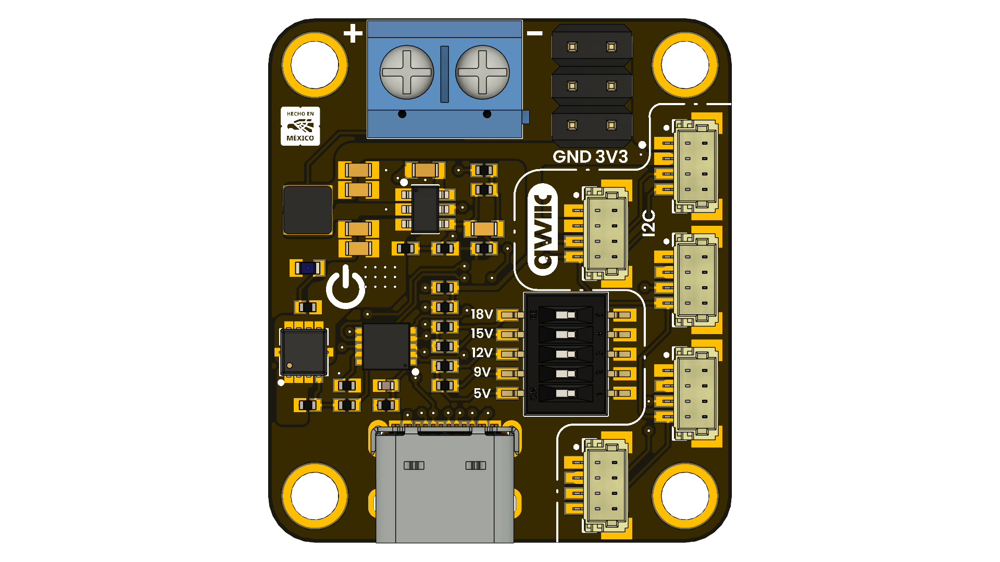

# DevLab: HUSB238 USB-C PD Module

## Introduction

This module is a versatile USB-C Power Delivery (PD) Sink and System Interface designed around the USB238 controller. It bridges the gap between modern USB-C power sources and embedded electronics, allowing you to negotiate high voltages for driving loads while simultaneously providing a regulated 3.3V rail for logic and sensors.

With onboard QWIIC connectors, this board integrates seamlessly into the I2C ecosystem, making it an ideal power hub for IoT projects, robotics, and rapid prototyping.

  
  
<em>HUSB238 USB-C PD Module</em>

### Quick Setup

## Overview

| Feature                | Description                                                      |
|------------------------|------------------------------------------------------------------|
| USB PD IC              | HUSB238                                                          |
| Compatible voltages    | 3.3V, 5V, 9V, 12V, 15V, 18V, 20V                                 |
| Maximum output current | 5A                                                               |
| Power Supply           | USB-C                                                            |
| Interfaces             | I2C, PD3.0m type-C V1.4, Apple Divider 3, BC1.2 SDP, CDP and DCP |
| Expansion Port         | I2C connector for sensors and modules                            |

* **Note:** Output voltages and currents may vary with the characteristics of the power supply  

## Applications

- **USB-C Power Upgrade:** Retrofit legacy DC-jack powered devices (routers, modems, soldering irons) to use modern USB-C chargers.
- **High-Power IoT Nodes:** Power 12V or 20V actuators/solenoids via the terminal block while powering an ESP32 or microcontroller via the 3.3V rail/Qwiic system.
- **Sensor Hub:** Acts as a central power and data injection point for Qwiic-based environmental sensor arrays.
- **Portable Lab Supply:** Create a compact, variable voltage power supply using a USB-C power bank.

## Resources

- <a href="./hardware/unit_sch_v_1_0_0_ue0084_devlab_husb238_usb-c_pd_module.pdf">Schematic Diagram</a>
- [Pinout Diagram](#)
- [Getting Started Guide](#)

## 📝 License

All hardware and documentation in this project are licensed under the **MIT License**.  
See [`LICENSE.md`](LICENSE.md) for details.

  Template created by UNIT Electronics

