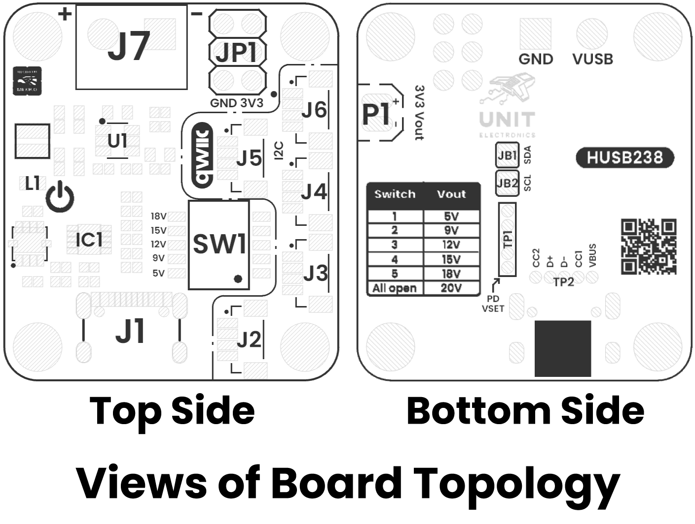
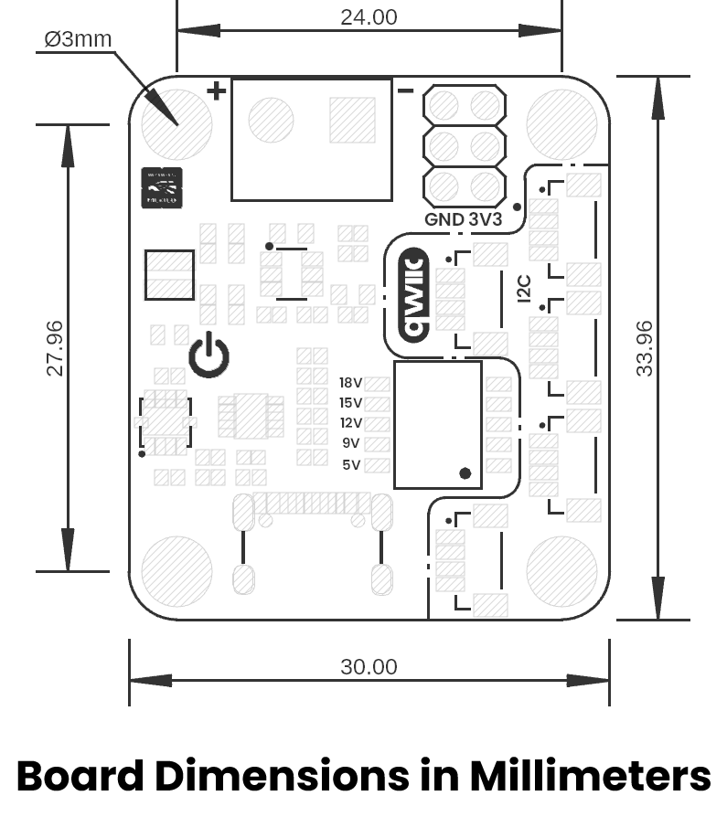

# Hardware

<a href="./unit_sch_v_1_0_0_ue0084_devlab_husb238_usb-c_pd_module.pdf"> Schematic</a>

## Key Technical Specifications

| **Parameter** |           **Description**            | **Min** | **Typ** | **Max** | **Unit** |
|:-------------:|:------------------------------------:|:-------:|:-------:|:-------:|:--------:|
|      Vin      | Input voltage to power on the module |    5    |    -    |   20    |    V     |
|      Vih      |   High-level input voltage for I2C   |   1.4   |    -    |   5.5   |    V     |
|      Vil      |   Low-level input voltage for I2C    |    -    |    -    |   0.4   |    V     |
|      Icc      |            Supply Current            |    -    |   3.1   |    -    |    mA    |
|     I3v3      |   3V3 Power Supply Output Current    |    -    |    -    |    2    |    A     |
 

* **Note:** Output voltages and currents may vary with the characteristics of the power supply 

## Pinout

    <a href="#"> Pinout</a>
     
     
     
    

| Pin Label | Function    | Notes                             |
|-----------|-------------|-----------------------------------|
| VCC       | Power Supply| 3.3V or 5V                       |
| GND       | Ground      | Common ground for all components  |

## Pin & Connector Layout

| Pin   | Voltage Level | Function                                                  |
|-------|---------------|-----------------------------------------------------------|
| VCC   | 3.3 V – 5.5 V | Provides power to the on-board regulator and sensor core. |
| GND   | 0 V           | Common reference for power and signals.                   |
| SDA   | 1.8 V to VCC  | Serial data line for I²C communications.                  |
| SCL   | 1.8 V to VCC  | Serial clock line for I²C communications.                 |

> **Note:** The module also includes a Qwiic/STEMMA QT connector carrying the same four signals (VCC, GND, SDA, SCL) for effortless daisy-chaining.

## Topology

<a href="./resources/unit_topology_v_1_0_0_ue0084_devlab_husb238_usb-c_pd_module.png>  Topology</a>
 
 
 

| Ref.  | Description                                             |
|-------|---------------------------------------------------------|
| J1    | USB Type-C Connector                                    |
| J2-J6 | QWIIC Connectors for I2C (JST 1mm)                      |
| J7    | Screw Terminal Block for VUSB                           |
| L1    | Power On LED                                            |
| IC1   | HUSB238                                                 |
| SW1   | Dip Switch for voltage selector                         |
| U1    | TPS54302 3.3V Regulator                                 |
| JP1   | Pin Header for 3V3 power supply and GND                 |
| JB1   | Jumper Bridge to Join HUSB238 SDA with QWIIC Connectors |
| JB2   | Jumper Bridge to Join HUSB238 SCL with QWIIC Connectors |
| P1    | Pads for 3.3V Power Supply                              |
| TP1   | Test Points for PD Vset                                 |
| TP2   | USB Test Points                                         |

## Dimensions

<a href="./resources/unit_dimension_v_1_0_0_ue0084_devlab_husb238_usb-c_pd_module.png">  Dimensions</a>

# References

- <a href="./resources/unit_datasheet_v_1_0_0_ue0084_husb238.pdf">HUSB238 Datasheet </a>
- <a href="./resources/unit_datasheet_v_1_0_0_ue0084_tps54302.pdf">TPS54302 Datasheet </a>
